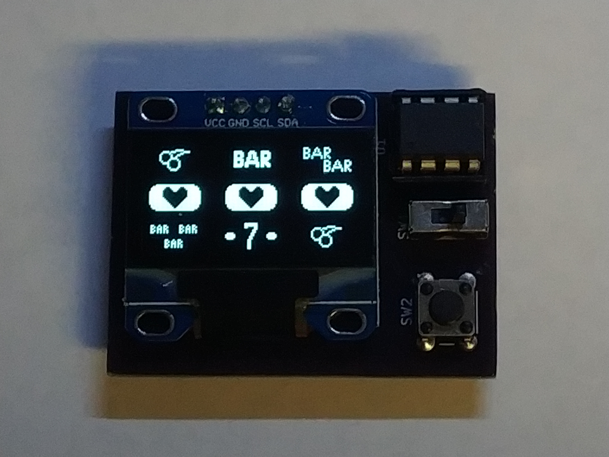
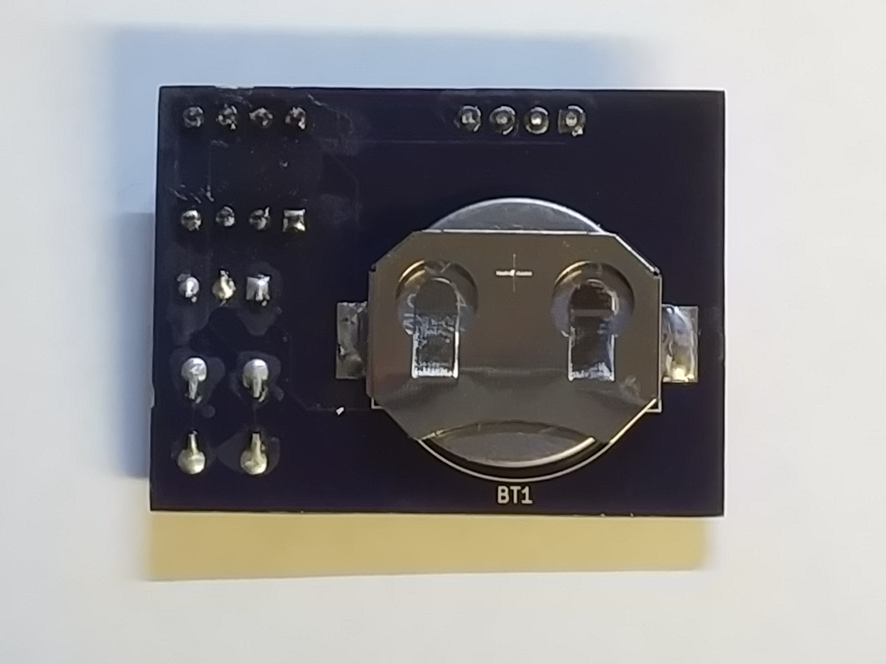

# attiny85_slots
Slot machine toy using an attiny85, ssd1306, and a single button.

### Requirements
Uses SpenceKonde's ATTinyCore.  
in arduino settings, add http://drazzy.com/package_drazzy.com_index.json to the 'additional board manager urls', then the above will appear in your board manager as "ATTinyCore"  
Or pull it manually from https://github.com/SpenceKonde/ATTinyCore  
(Others will probably work too, but are untested)

The included ssd1306 tiny lib also uses SoftI2C (https://github.com/felias-fogg/SoftI2CMaster.git)  
It can be made to work with something like tinywire, but this lib is way faster.

Use 16MHZ PLL clock, Disable B.O.D, Timer 1 CPU, LTO Disabled. (Fuses: E:FF, H:D7, L:F1)

### Notes:
There are multiple different manufacturers making ssd1306 breakouts, and their pins are not always the same. This build uses the i2c version (not spi), with pins in the order vcc, gnd, scl, sda.  
Many swap the vcc/gnd pins, and that would end badly...

The board was designed as small and simple as possible. Realistically, it _should_ have a capacitor on the power pins of the attiny, some pull-up resistors on the i2c pins, and probably a pull-up resistor on the button.

